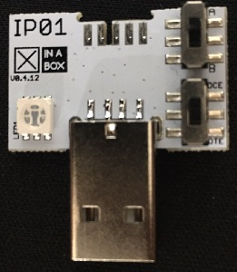

# ☒CHIP IP01

## General Description
This ☒CHIP forms part of the interface modules and is equipped with USB power and programming module. The USB connector can supply power to units, and is required for programming the CPUs on the xCHIP sensors. The IP01 ☒CHIP is housed in an extremely compact 2U×2U chip with one connection port.

## Key Features
- USB A connector
- Can be used to program core ☒CHIPs CW01, CR01 and CC01
- RGB LED (fixed configuration)
- Based on FT232R

## Windows Driver
- If the IP01 is not recognised on your windows PC please intall the file provided under [drivers](https://github.com/xinabox/xIP01/tree/master/drivers) or simply click the following [link](https://github.com/xinabox/xIP01/blob/master/drivers/FTDI%20Driver%20(CDM_v2.12.00_WHQL_Certified).exe) and install once download has completed.

